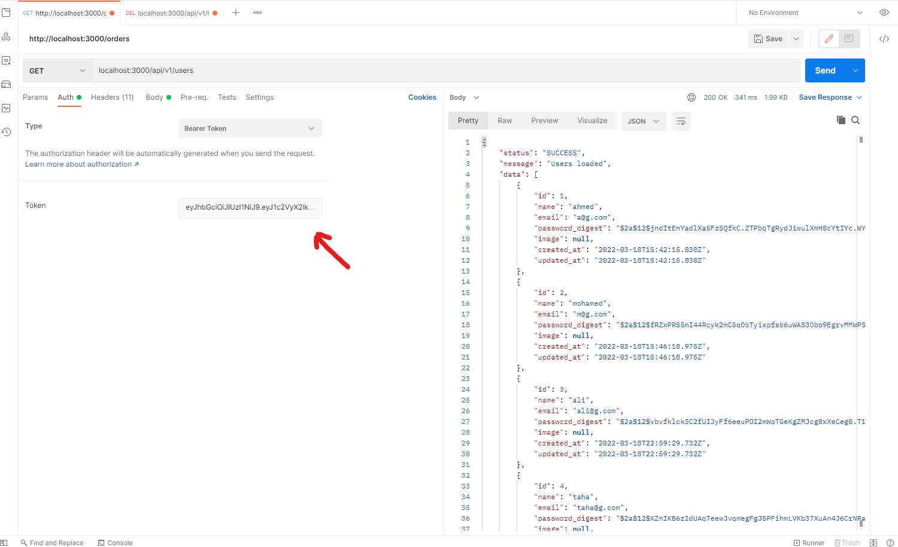
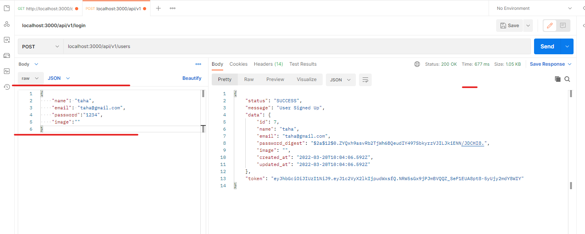
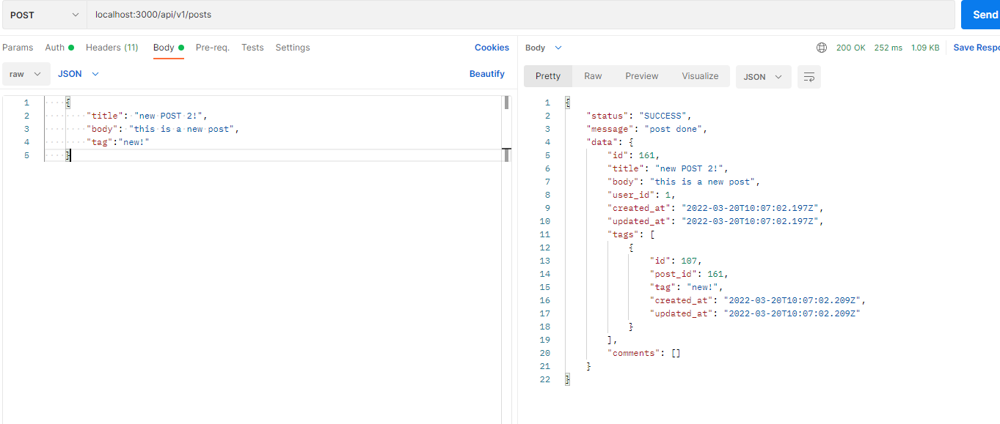
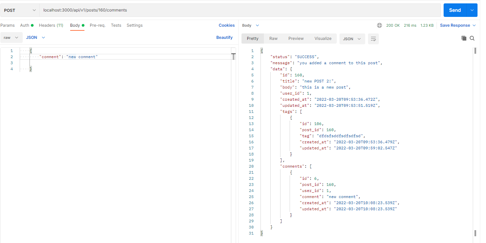
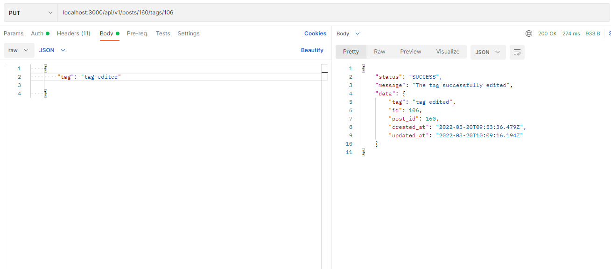

# A Basic Blog API

## Table of Content📃

- [Prerequisites](#prerequisites)
- [Instructions](#instructions)

## 🥇Prerequisites

Your machine must have the following installed on it:

- [Rails framework](https://rubyonrails.org/2022/3/8/Rails-7-0-2-3-6-1-4-7-6-0-4-7-and-5-2-6-3-have-been-released)
- mysql 2

### Install redis

```
sudo apt install redis-server
```

### Install sidekiq

```
sudo apt-get install ruby-sidekiq
```

## 📝Instructions

### 1. ⬇️Install Gems

After Cloning the project, head inside the project folder and run

```
bundler install
```

### 2. 🛠️DB Creation and Migrations

- Create user (admin) in with password admin

```
CREATE USER 'admin'@'localhost' IDENTIFIED BY 'admin';
```

- Create a database (blog)

```
CREATE DATABASE blog
```

- Grant all permissions to the user (admin)

```
GRANT PRIVILEGE ON *.* TO 'admin'@'localhost'
```

- Now, Run the migrations

```
rails db:migrate
```

### 3. 🟢Starting the project

```
rails server
```

### Starting the redis server

```
redis-server
```

### Starting sidekiq

```
sidekiq
```

And by now you should be able to go to `localhost:3000/api/v1` to test that everything is working as expected.

### 🚧The Users Endpoints

for authentication purposes add the user token you got when you signed up to the authentication header or you will get `please log in` error


_adding token_

- `localhost:3000/api/v1/users` return all users from the database **[GET]** **_token required_**
- `localhost:3000/api/v1/users/:id` return one user from database by id **[GET]** **_token required_**
- `localhost:3000/api/v1/users` insert new user in the database **[POST]**

_new user example_
- `localhost:3000/api/v1/login` take the user credentials and return its record from the database and his token **[POST]**
- `localhost:3000/api/v1/auto_login` return the user record from the database by the token **[GET]** **_token required_**

### 🚧The Posts Endpoints

- `localhost:3000/api/v1/posts` return all posts from the database **[GET]** **_token required_**
- `localhost:3000/api/v1/posts` insert new post in the database **[POST]** **_token required_**

_new post example_
- `localhost:3000/api/v1/posts/:id` return one post from database by id **[GET]** **_token required_**
- `localhost:3000/api/v1/posts/:id` Delete post by its id **[DELETE]** **_token required_**
- `localhost:3000/api/v1/posts/:id` edit post by its id **[PUT]** **_token required_**
- `localhost:3000/api/v1/posts/:id/comments` return all the comments on that post in the database **[GET]** **_token required_**
- `localhost:3000/api/v1/posts/:id/comments` add new comment on that post **[POST]** **_token required_**

_new comment example_
- `localhost:3000/api/v1/posts/:id/comments/:id` return one comment on that post by its id **[GET]** **_token required_**
- `localhost:3000/api/v1/posts/:id/comments/:id` Edit One comment by its id on that post **[PUT]** **_token required_**
- `localhost:3000/api/v1/posts/:id/comments/:id` Delete the comment by its id on that post **[DELETE]** **_token required_**
- `localhost:3000/api/v1/posts/:id/tags/:id` Edit tag on a post by its id **[PUT]** **_token required_**

_tag edit example_
